<div align="center">

# Scanit

**Turn a photo of a document into a clean, flat scan with two U-Nets trained on synthetic data.**


</div>

<p align="center">
  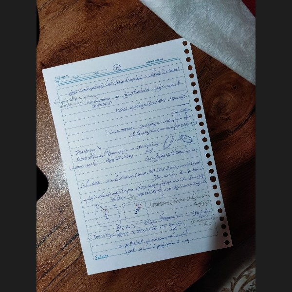
  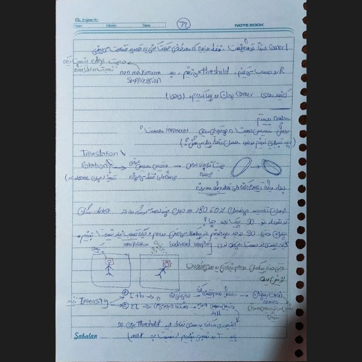
  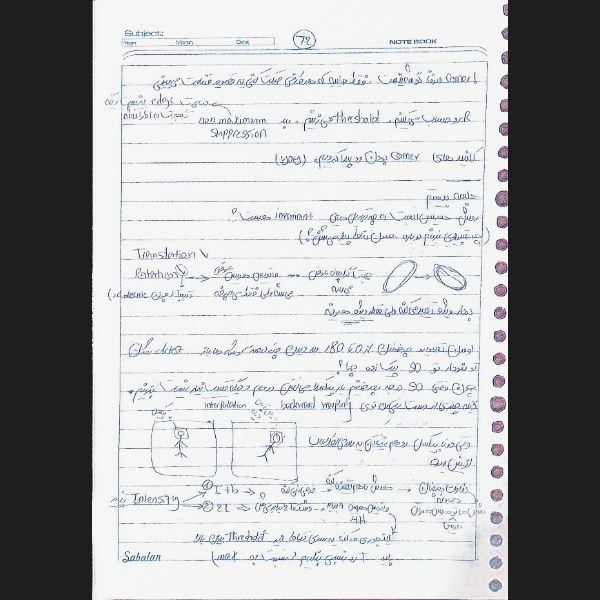
</p>

## 📖 Overview

Scanit is a two-stage document-scanning pipeline built with PyTorch:

1. **Corner detection**: a U-Net predicts Gaussian heatmaps for the document's four corners; the peaks are read off the heatmaps and used to perspective-warp the page flat.
2. **Enhancement**: a second U-Net removes shadows, blur, noise and compression artifacts from the warped page, producing a clean, high-contrast scan.

The project also includes a Streamlit demo app, the training and evaluation scripts behind every reported result, an OCR benchmark that measures how much easier the enhanced scan is to read by machine, and a fully synthetic data pipeline that removes the need for manual labeling.

### 🏆 Headline results (synthetic test sets)

| Task | Baseline | Scanit |
|---|---|---|
| Corner detection, mean error | 15.99 px (direct regression) | **2.47 px** (heatmap) |
| Corner detection, success rate | 20.5% | **95.0%** |
| Enhancement, PSNR | 16.99 dB (degraded input) | **21.36 dB** |
| Enhancement, SSIM | 0.7885 | **0.8578** |

## ✨ Features

- Two-stage pipeline: heatmap-based corner detection, perspective rectification, image enhancement
- Streamlit demo app: upload a photo, view the warped and enhanced result, download the scan
- Fully synthetic training data generated programmatically; no manual annotation required
- Device auto-detection (CUDA / MPS / CPU) in the inference engine
- OCR benchmark (CER/WER) comparing the original photo against the enhanced output

## 🖥️ Demo app

`app.py` serves a Streamlit UI where you can upload a photo, pick the models, and inspect the intermediate steps (corners, heatmaps) side by side with the final scan.


<p align="center">
  
  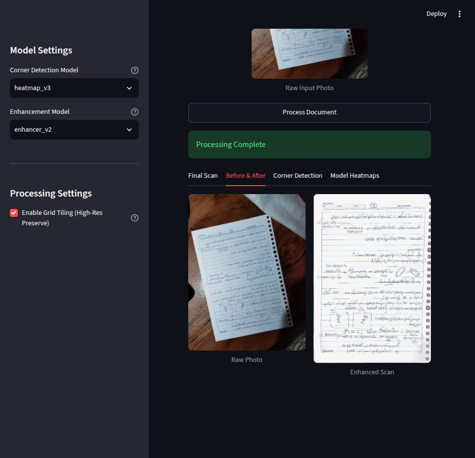
</p>

## ⚙️ How it works

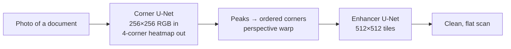

### 🔍 Corner detection

The detector is a U-Net-style encoder-decoder that takes a 256×256 RGB image and outputs four heatmaps, one Gaussian blob per document corner. Corner coordinates are the argmax of each heatmap.

An earlier variant predicted the eight corner coordinates directly (direct regression). It performed considerably worse than the heatmap approach; see the Results section.

<p align="center">
  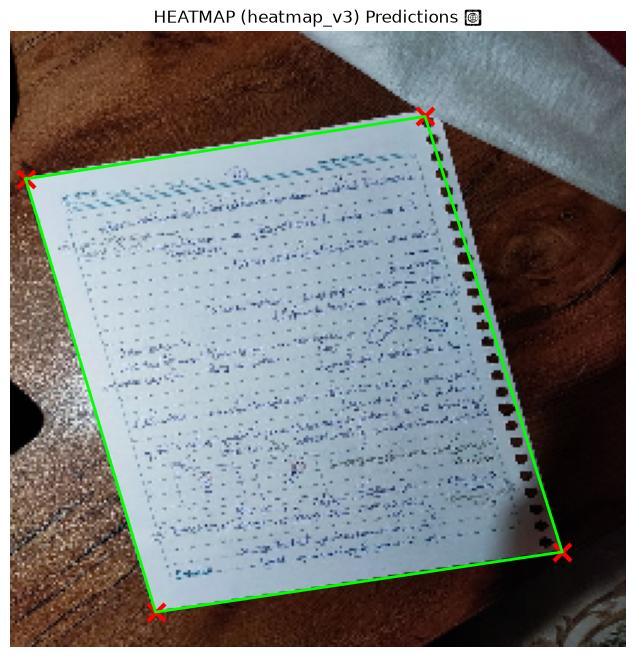
  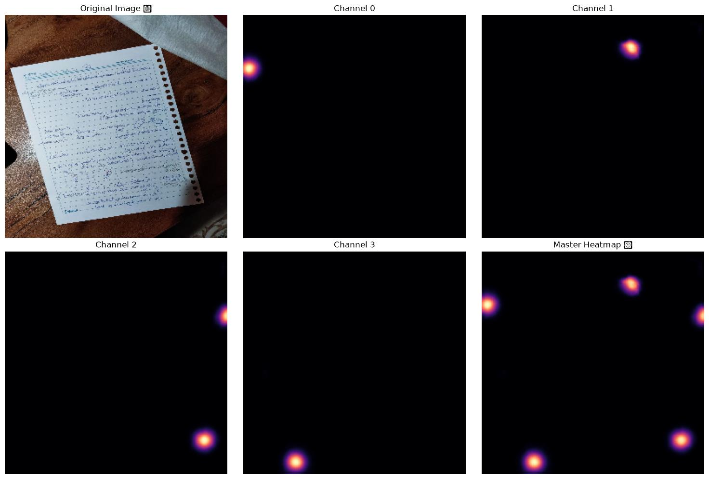
</p>

### 📐 Rectification

The four peaks are ordered (top-left, top-right, bottom-right, bottom-left) and an OpenCV perspective transform unwarps the quad into a rectangular page.

### ✨ Enhancement

The enhancer is a second U-Net operating on 512×512 RGB tiles (larger pages are processed with an overlap-tiled grid). It is trained to invert the synthetic degradation pipeline (shadows, blur, noise, JPEG compression) using a weighted combination of **L1, MS-SSIM and Sobel edge** losses.

## 📊 Results

All metrics are produced by `evaluate.py`, which also renders the result tables committed under `evaluation/`.

### Corner detection: heatmap vs. direct regression

On the synthetic test set (images the models never saw):

| Model | Mean corner error | Success rate |
|---|---|---|
| Direct regression (`direct_v3`) | 15.99 px | 20.5% |
| **Heatmap (`heatmap_v3`)** | **2.47 px** | **95.0%** |

The heatmap model was additionally evaluated on **real photos**, using a COCO segmentation dataset (document masks → ground-truth quads) via `evaluate_coco_corners()`.

Training loss comparison:

<p align="center">
  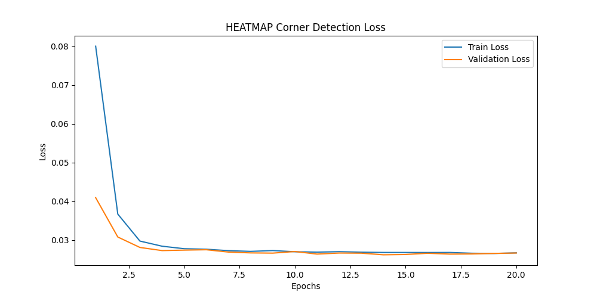
  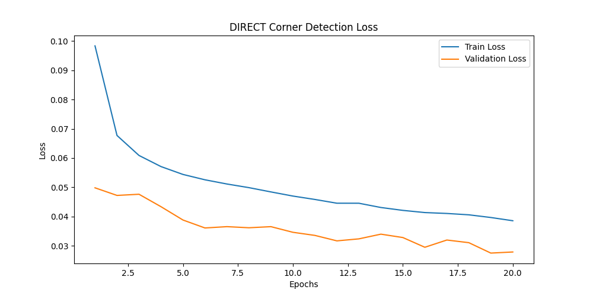
</p>

The heatmap model converges within a few epochs and stays stable. On the direct model the validation loss sits below the training loss, the typical signature of Dropout being active during training and disabled at evaluation.

### Enhancement: `enhancer_v2`

PSNR / SSIM against the clean ground-truth scans, on the test split:

| Input | PSNR | SSIM |
|---|---|---|
| Degraded (synthetic camera) image | 16.99 dB | 0.7885 |
| **After Scanit enhancement** | **21.36 dB** | **0.8578** |

**+4.4 dB PSNR** and **+0.07 SSIM** over the degraded input.

Training curve for the enhancer; validation loss bottoms out at epoch 3 (marked), after which the model begins to overfit, so the checkpoint from that epoch is kept:

<p align="center">
  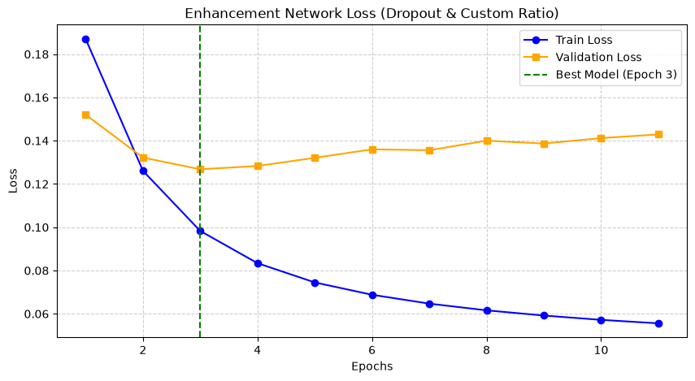
</p>

### 📉 The end-to-end experiment (`e2e_v1`)

As the bonus part of the project, the corner detector and the enhancer were chained into a single differentiable pipeline using kornia: the corner model regresses the four corners, a differentiable perspective warp rectifies the image, and the enhancer cleans up the result. Both networks start from their pretrained checkpoints and are fine-tuned jointly with a combined corner (MSE) + enhancement (L1) loss.

It underperformed the two-stage pipeline and is included in the repository for reference. The most likely reasons:

- **It inherits the weaker corner detector**: heatmap peaks cannot be differentiated through the warp, so the joint model is built on direct regression, the 15.99 px corner model, instead of the 2.47 px heatmap model.
- **Unstable gradients through the warp**: with a differentiable perspective transform, a small update to the corners changes every pixel of the warped image, so the enhancement loss pushes large, noisy gradients into the corner branch.
- **Catastrophic forgetting**: joint fine-tuning pulls both pretrained networks away from the optima they had already reached when trained separately.

The joint loss itself converges cleanly, which shows the problem is not optimization but what the joint objective does to the two tasks:

<p align="center">
  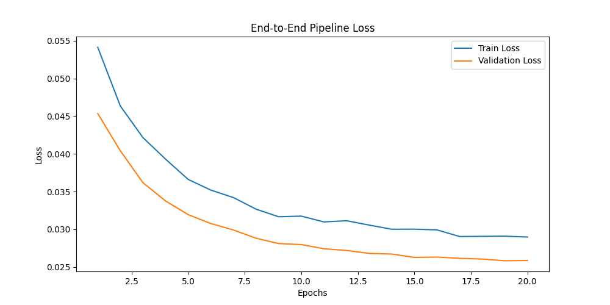
</p>

**Takeaway**: two small specialized models outperformed one joint model, which is why the shipped pipeline is `heatmap_v3` → warp → `enhancer_v2`.

## 📈 Model versions

Corner detection and enhancement each went through several iterations. Following the project specification, every task was first trained without regularization and then again with it; the shipped models are the regularized ones. Notes kept during development:

| Version | Notes |
|---|---|
| `direct_v1` | Dataset not diverse enough; the network turned "lazy" and regressed toward the page center |
| `direct_v2` | Better dataset, still not accurate enough |
| `direct_v3` | Regularized (BatchNorm + Dropout); final direct-regression model |
| `heatmap_v1` | Rotated documents mixed up the corners (multiple corners activating per channel); fixed by enforcing a consistent corner ordering during dataset generation |
| `heatmap_v2` | Second iteration with the corrected corner ordering |
| `heatmap_v3` | Regularized (BatchNorm + Dropout); shipped corner model |
| `enhancer_v1` | Baseline U-Net, no regularization |
| `enhancer_v2` | Regularized U-Net (BatchNorm + Dropout); shipped enhancer |
| `e2e_v1` | Direct regression + enhancer chained through a differentiable warp and fine-tuned jointly; underperformed the two-stage pipeline (see Results) |

## 📁 Project layout

| Path | What it is |
|---|---|
| `engine.py` | `DocumentScannerEngine`: loads the trained models and runs the full pipeline (device auto-detection: CUDA / MPS / CPU) |
| `model.py` | U-Net architectures for corner detection and enhancement, plus legacy models (direct regression, e2e) |
| `app.py` | Streamlit demo: upload a photo → warped + enhanced result → download |
| `dataset.py` | Synthetic dataset generation: composites clean scans onto backgrounds with random perspective + shadows |
| `utils.py` | Degradation pipeline (blur, noise, JPEG compression) + shared helpers |
| `train.py` | Training loops for the heatmap, direct-regression, enhancer and e2e models |
| `train_dry_run.py` | Tiny CPU smoke test of the training loop |
| `evaluate.py` | Corner-error and PSNR/SSIM metrics; renders the tables in `evaluation/`; real-image (COCO) corner eval |
| `ocr.py` | OCR benchmark (pytesseract, `eng` + `fas`): CER/WER of the original photo vs. the Scanit output |
| `evaluation/` | Result tables (PNG) rendered by `evaluate.py` |

(`models/` is gitignored and holds trained weights and per-version prediction outputs)

## 🚀 Getting started

```bash
git clone https://github.com/hossless/scanit.git
cd scanit
python -m venv venv && source venv/bin/activate
pip install -r requirements.txt
streamlit run app.py
```

Notes:

- **Trained weights are not included.** The code expects each model's best checkpoint under `models/<version>/` (for example `models/heatmap_v3/heatmap_best.pth`). Retrain using the instructions below, or drop in your own.
- The `torch` pin comes from the CPU build used during development. For GPU support, install the matching CUDA wheel following [pytorch.org](https://pytorch.org/get-started/locally/).
- `ocr.py` additionally requires the **Tesseract binary** plus the `eng` and `fas` language data.

## 🏋️ Training on your own data

1. **Data**: put clean document scans in `data/scan/` and background images in `data/background/`, then run `dataset.py` to generate the warped and degraded synthetic sets under `data/ready_dataset/{corner,enhancer}/` (train/val/test splits included).
2. **Train**: `train.py` contains the training loops for each model version. `train_dry_run.py` runs a small end-to-end sanity check on CPU.
3. **Evaluate**: `evaluate.py` recomputes the metrics and regenerates the tables into `evaluation/`.

⚠️ Note: paths inside `dataset.py` and `train.py` were written for a Colab environment (`/content/...`); adjust the path constants for local runs.

## 🧪 How the synthetic data is made

1. A clean scan is composited onto a random background image.
2. A random perspective quad warps it to simulate a camera viewpoint, and soft shadows are drawn on top.
3. The degradation pipeline adds blur, sensor noise and JPEG compression, producing a realistic phone-photo look.
4. Ground truth comes for free: the corner quad becomes Gaussian heatmaps for the corner model, and the original clean scan is the enhancer target.

Because everything is generated programmatically, the ground truth is pixel-perfect and effectively unlimited, with no manual labeling.

## 🤔 Limitations

- **Heatmap quantization**: corners are read by argmax on a 256×256 heatmap, so localization is inherently ~1 px at that scale (scaled up after warping). A soft-argmax or sub-pixel refinement would tighten this.
- **Synthetic-only enhancement evaluation**: the enhancement numbers are on the synthetic test set. The corner model is additionally validated on real COCO photos, but enhancement is not yet benchmarked on real paired data.
- **e2e_v1 underperforms**: see the end-to-end note in the Results section.
- **CPU inference speed**: tiling the enhancer over large images works, but is slow on CPU. A GPU is recommended for interactive use.
